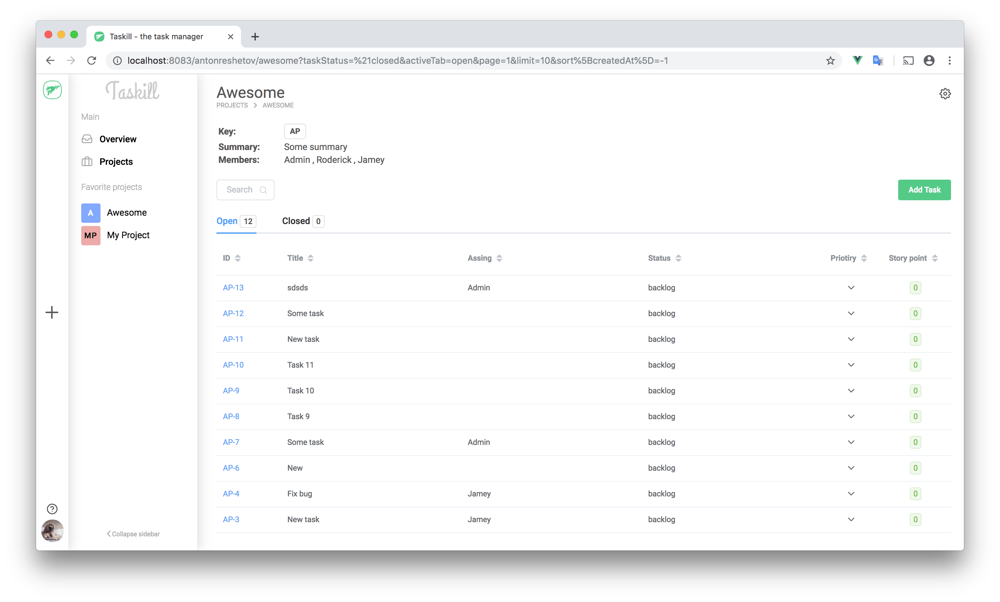

# Taskill

> WIP

The goal of this project is to create an open source independent task manager on a javascript stack that can be use locally or in web. Idea of creation inspired by redmine



## Use

> Docker must be installed

### Production

Clone the repo, setup the env variables and run

```bash
(cd docker/prod && docker-compose up --build -d )
```

Go to the `http://localhost` on local machine or your domain address on server

**Env variables**

```bash
# Client
VUE_APP_SERVER_API= # service URI API, example: http://yourdomain.com/api or http://localhost to local use
# Server
API_PORT= # service server port, example: 3000, if other, you must be setup proxy nginx
DEBUG= # express debug mode
CLIENT_URI= # service client URI for CORS, example: http://yourdomain.com, or http://localhost to local use
MONGO_URI= # service mongo URI, exmaple mongodb://mongo:27017/taskill, (mongo - service DNS)
SECRET_KEY= # random string as salt to generate token
MAIL_HOST= # SMTP server email client
MAIL_PORT= # email port
MAIL_USER= # email login
MAIL_PASS= # email password
```

### Development

Clone the repo, setup the env variables and run

```bash
(cd docker/dev && docker-compose up --build -d)
```

**Env example**

`docker/dev/.env`

```bash
# Client
VUE_APP_PORT= # client port, example 4000
VUE_APP_HOST= # must be 0.0.0.0
VUE_APP_SERVER_API= # service URI API, for dev example: http://localhost:3000/api, port must be equal API_PORT
# Server
API_PORT= # service server port, example: 3000
DEBUG= # express debug mode
CLIENT_URI= # service client URI for CORS, for dev example: http://localhost:4000, port must be equal VUE_APP_PORT
MONGO_URI= # service mongo URI, example mongodb://mongo:27017/taskill, (mongo - service DNS)
SECRET_KEY= # random string as salt to generate token
MAIL_HOST= # SMTP server email client
MAIL_PORT= # email port
MAIL_USER= # email login
MAIL_PASS= # email password
```

## Launch

```bash
# Client
npm run serve
# Server
cd server
npm start

```

## Roadmap

### Client

- [x] Layout
- [ ] Sing in / Sing up / Reset
- [ ] Projects
- [ ] Project
- [ ] Project settings
- [ ] Project add new
- [ ] Tasks
- [ ] Task
- [ ] Task add new view
- [ ] User profile view

### Server

- [x] Sing in / Sing up / Reset
- [x] Authorization by JWT
- [x] Project CRUD
- [x] Project add to favorite
- [ ] Task CRUD
- [x] Task assignee
- [x] Members & transfer
- [x] Roles
- [ ] Comments
